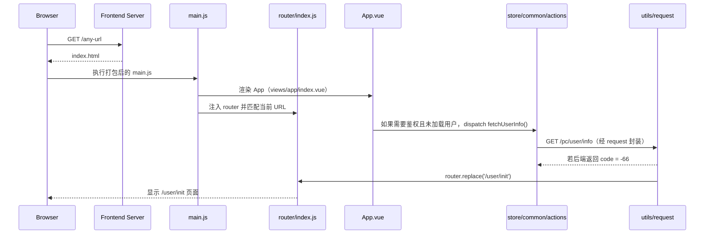
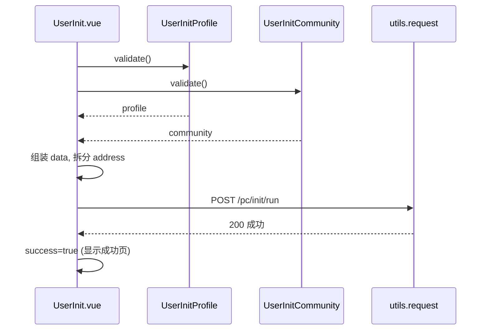

## /user/init 渲染链路与组件说明（console-web）

本篇文档详细梳理当访问 `/user/init` 时，前端如何一步步解析路由、加载页面、装配自定义与三方组件、触发表单校验与提交流程；并给出组件树与时序图，标注每个模块来源（自定义 or 三方库）与职责。

### 0. 启动与首个请求

运行环境与入口：

- 开发环境（webpack-dev-server / vue-cli-service serve）
  - 启动本地静态资源服务器与 HMR 热更新；
  - 开启 History Fallback：除真实存在的静态资源外，所有路径回退到 `index.html`，支持 SPA 多路由；
  - 依据 `vue.config.js` 配置代理、静态资源、publicPath 等。
- 生产环境（Nginx 等静态服务器）
  - 提供 `index.html` 与 `dist/` 目录；
  - 配置 History Fallback（如 `try_files $uri /index.html;`）；
  - 可配置 gzip、缓存、反代 API。

加载顺序：

1) 浏览器访问任意 URL（如 `/anything`）→ 前端服务器返回 `index.html`；
2) 浏览器加载打包 JS，执行 `src/main.js`：
   - 创建根实例 `new Vue({ router, store, render: h => h(App) }).$mount('#app')`；
   - `App` 即 `views/app/index.vue`，应用一启动就加载；
3) 前端路由 `src/router/index.js` 根据当前 URL 做匹配，执行 `beforeEach/afterEach`；
4) 进入页面后，壳组件或页面组件触发“首个 API 请求”，常见触发点：
   - 鉴权页面：`views/app/index.vue` 监听 `$route`，在目标路由 `meta.authRequired` 且尚未拿到 `userInfo` 时派发 `store/common/actions.js > fetchUserInfo()`，内部 `utils.request.get('/user/info')`；
   - 组件初始化：如 `components/image-upload/index.vue` 在 `created` 获取存储配置；
5) 统一请求封装 `src/utils/request.js`：
   - 请求拦截：加 token、`/pc` 前缀、设置 `Content-Type`；
   - 响应拦截：`code===-66`（系统未初始化）时执行 `router.replace('/user/init')`，从而把用户引导到初始化页面。

Store 与 Vuex：

- `src/store/index.js` 导出的是一个 Vuex Store：
  - 通过 `Vue.use(Vuex)` 安装；
  - `new Vuex.Store({ state, mutations, actions, modules })` 创建；
  - 被注入到根实例（`main.js` 的 `store` 字段），在所有组件内可通过 `this.$store` 使用；
- 与 Vuex 的关系：`store` 就是 Vuex 的实例，负责全局状态（如 `common` 模块中的 `userInfo/postInfo` 等）、同步变更（`mutations`）、异步流程（`actions`）。
- 典型用法：
  - `views/app/index.vue` 使用 `mapActions` 派发 `common/fetchUserInfo`；
  - `store/common/actions.js` 中 `fetchUserInfo` 调用 `utils.request.get('/user/info')` 获取用户信息并提交 `mutations`；
  - 组件通过 `mapGetters` 读取 `common/userInfo`、`common/postInfo` 等。

简要时序（从输入 URL 到引导 `/user/init`）：



### 1. 顶层入口与全局依赖

涉及文件：

- 自定义：`src/main.js`
- 三方：`vue`、`vue-router`、`view-design`（View UI）、`vue-lazyload`、`awe-dnd`、`moment`

关键要点：

- 创建 `Vue` 实例，注入 `router`、`store`，挂载到 `#app`。
- 注册全局过滤器、懒加载、拖拽等插件。

片段（简化）：

```js
new Vue({
    router,
    store,
    render: h => h(App)
}).$mount('#app');
```


### 2. 路由解析：为何会加载到 `user/init/index.vue`

涉及文件：

- 自定义：`src/router/index.js`、`src/views/user/router.js`、`src/views/user/init/router.js`、`src/views/user/index.vue`
- 三方：`vue-router`、`view-design` 的 `LoadingBar`

解析链路：

1) 顶层路由聚合（`src/router/index.js`）

```js
export const routes = [
    require('@/views/home/router'),
    require('@/views/user/router'),
    // ... 其它模块
];

const router = new VueRouter({
    mode: 'history',
    routes
});
```

- 将 `user` 模块的路由注册到全局。
- `mode: 'history'` 采用 HTML5 History 模式（无 #，需要服务器回退到 index.html）。

2) `user` 模块定义（`src/views/user/router.js`）

```js
module.exports = {
    path: '/user',
    component: () => import('./'),
    children: [
        require('./init/router'),
        require('./login/router'),
        require('./zone/router')
    ]
};
```

- 父路由 `/user` 使用 `views/user/index.vue` 作为容器。
- 子路由包含 `init`、`login` 等。

3) `init` 子路由（`src/views/user/init/router.js`）

```js
module.exports = {
    path: 'init',
    component: () => import('./index')
};
```

- 路径为相对 `'init'`，与父 `/user` 组成最终路径 `/user/init`。
- 懒加载 `views/user/init/index.vue`。

4) 用户容器（`src/views/user/index.vue`）

```vue
<template>
  <router-view />
  <!-- 这里承载子路由页面，如 /user/init -->
</template>
```

- 该容器只负责渲染子路由。

路由解析流程图：

```mermaid
graph LR
  A[浏览器访问 /user/init] --> B[router/index.js 注册 user 模块]
  B --> C[/user 路由: views/user/index.vue]
  C --> D[/user/init 子路由: views/user/init/index.vue]
```


### 3. 初始化页的页面装配：`views/user/init/index.vue`

涉及文件：

- 自定义：`src/views/user/init/index.vue`
- 自定义通用组件：`@/components` 下的 `SimpleHeader`、`Result`、`Copyright`
- 自定义页面子表单：`views/user/init/components/profile.vue`、`community.vue`
- 三方：`view-design` 的 `Button`、`Icon`

职责与结构：

- 头部：`<SimpleHeader title=系统初始化信息>`（自定义）
- 主体：两个子表单组件——个人资料 `UserInitProfile` 与小区信息 `UserInitCommunity`
- 操作：`立即初始化` 按钮，触发 `submit()`
- 成功态：切换为 `Result` 成功信息与 `立即登录` 按钮

组件树：

```mermaid
graph TD
  UI[UserInit (index.vue)] --> H[SimpleHeader (自定义)]
  UI --> P[UserInitProfile (自定义)]
  UI --> C[UserInitCommunity (自定义)]
  UI --> BTN[Button (view-design)]
  UI --> R[Result (自定义组件集合)]
  UI --> CP[Copyright (自定义)]
```

提交逻辑（合并两个表单的数据，拆分 address）：

```js
submit() {
  Promise.all([this.$refs.profile.validate(), this.$refs.community.validate()])
    .then(([profile, community]) => {
      const data = {
        ...profile,
        ...community,
        province: community.address[0],
        city: community.address[1],
        district: community.address[2]
      };
      delete data.address;
      this.submiting = true;
      utils.request.post('/init/run', data)
        .then(() => { this.submiting = false; this.success = true; })
        .catch(() => (this.submiting = false));
    })
    .catch(() => this.$Message.error('请检查配置信息是否完整'))
}
```

说明：

- 两个子表单组件通过 `ref` 暴露 `validate()`，校验成功 resolve 自身数据。
- 将地址数组拆为 `province/city/district`，避免后端自行解析。
- 调用统一请求工具 `utils.request`（见第 6 节）向 `/pc/init/run` 提交。

时序图（点击“立即初始化”）：




### 4. 子表单：`UserInitProfile`（个人资料）

涉及文件：

- 自定义：`views/user/init/components/profile.vue`
- 自定义通用：`@/components` 下的 `FormField`、`ImageUpload`
- 公用 mixin：`src/mixins/form.js`
- 三方：`view-design` 的 `Card`、`Form`、`Input`

结构与职责：

- 外层 `Card` 显示块。
- `Form` 结合 `:model="form"` 与 `:rules="rules"` 绑定数据与校验。
- 每个字段通过自定义 `FormField` 包裹具体控件，实现统一样式与响应式宽度。
  - 文本：`Input`（view-design）
  - 图片：`ImageUpload`（自定义，内部用 view-design Upload + 统一上传服务）

校验规则要点：

- 姓名必填、最长 8
- 身份证格式校验
- 头像必填
- 手机 11 位数字
- 账号最少 4、密码最少 6，二次密码一致性校验（自定义 validator）

对外接口：

- `validate()` 返回 Promise，内部调用 `this.$refs.form.validate(valid => { ... })`，通过后 `resolve(this.form)`。


### 5. 子表单：`UserInitCommunity`（小区信息）

涉及文件：

- 自定义：`views/user/init/components/community.vue`
- 自定义通用：`@/components` 下的 `FormField`、`ImageUpload`、`AreaSelect`
- 公用 mixin：`src/mixins/form.js`
- 三方：`view-design` 的 `Card`、`Form`、`Input`、`Switch`
- 三方数据：`area-data/pcaa`

结构与职责：

- 外层 `Card`，内含 `Form`。
- 字段：小区名、所在地三级联动（`AreaSelect`）、客服电话、照片、功能开关、车位绑定上限等。
  - `AreaSelect` 使用 `Row/Col/Select/Option`（view-design）与 `area-data` 实现级联选择，`v-model` 输出 `[省, 市, 区]`。
  - 开关 `OSwitch` 实际是 view-design 的 `Switch` 重命名，`true-value/false-value` 将布尔映射为数值 1/0。

校验规则要点：

- 小区名称必填、最长 12
- 所在地三联动必须完整选择（数组长度 3）
- 电话 11 位数字
- 照片必传
- 各类开关为 number 类型
- 车位绑定数量正整数

对外接口：

- `validate()` 同上，校验通过返回 `this.form`。


### 6. 通用表单容器与自适配：`FormField` 与 `formMixin`

涉及文件：

- 自定义：`src/components/form-field/index.vue`、`src/mixins/form.js`
- 三方：`view-design` 的 `FormItem`

职责分工：

- `FormField`
  - 内部使用 `FormItem` 承载 label、错误提示、校验联动。
  - 用一个 `.form-field` 容器包裹插槽，提供单位、副标题等增强。
  - 接收 `width`，结合 `formMixin` 中的 `winWidth` 与 `FORM_ADAPT_WIDTH`，在宽屏时限定像素宽，窄屏走自适应。

- `formMixin`
  - 监听窗口 `resize`，维护 `winWidth`。
  - 暴露 `mlabelPostion`（top/right）与 `mlabelWidth`，供 `Form` 标签位置与宽度响应式调节。

`FormField` 计算宽度（简化）：

```js
fieldStyle() {
  if (!this.width || this.winWidth < FORM_ADAPT_WIDTH) return ''
  return { width: `${this.width}px` }
}
```


### 7. 图片上传：`ImageUpload`

涉及文件：

- 自定义：`src/components/image-upload/index.vue`
- 三方：`view-design` 的 `Upload`、`Button`、`Icon`、`Progress` 与 `Message`
- 三方：`view-design/src/mixins/emitter`（派发到 `FormItem` 参与校验）
- 自定义工具：`utils.upload.getStorageConfig()`、`utils.upload.upload()`、`utils.image.parse()`

关键机制：

- 使用 `:before-upload="onBeforeUpload"` 接管上传，返回 `false` 阻止内置上传，改为走统一上传服务。
- 支持可选的尺寸校验（`width`/`height`）。
- 上传中显示进度条，成功后：
  - 设置 `result`（图片 URL）
  - `this.$emit('input', url)` 同步给 `v-model`
  - `this.dispatch('FormItem','on-form-change', url)` 触发 `FormItem` 校验


### 8. 统一请求工具与“未初始化跳转”

涉及文件：

- 自定义：`src/utils/request.js`
- 三方：`axios`、`view-design` 的 `Message`

关键逻辑：

- 请求拦截：统一 `Content-Type`、自动附加 Token、为 URL 加 `/pc` 前缀。
- 响应拦截：
  - `code===200`：直返数据
  - `code===-66`：`router.replace('/user/init')` 强制跳到初始化页面
  - 其它：弹出错误消息并 `reject`

这保证了即使用户没有主动访问 `/user/init`，在需要初始化时也会被引导到该页面。


### 9. 组件来源与分类

- 自定义组件（本仓库实现）：
  - 页面：`UserInit (index.vue)`、`UserInitProfile`、`UserInitCommunity`
  - 通用：`FormField`、`ImageUpload`、`AreaSelect`、`SimpleHeader`、`Result`、`Copyright`
- 三方组件库：
  - View UI（`view-design`）：`Form`、`FormItem`、`Input`、`Card`、`Switch`、`Button`、`Icon`、`Upload`、`Progress`、`LoadingBar` 等
  - Vue 插件：`vue-lazyload`、`awe-dnd`
  - 数据与工具：`area-data/pcaa`、`moment`

组件树（含来源标注）：

```mermaid
graph TD
  A[UserInit (自定义)] --> SH[SimpleHeader (自定义)]
  A --> P[UserInitProfile (自定义)]
  P --> PF[Form (view-design)]
  PF --> FF1[FormField (自定义)]
  FF1 --> I1[Input (view-design)]
  PF --> FF2[FormField (自定义)]
  FF2 --> U1[ImageUpload (自定义 -> Upload/Progress 等)]
  A --> C[UserInitCommunity (自定义)]
  C --> CF[Form (view-design)]
  CF --> CF1[FormField (自定义) -> Input]
  CF --> CF2[FormField (自定义) -> AreaSelect(自定义)]
  CF --> CF3[FormField (自定义) -> Switch(view-design)]
  A --> BTN[Button (view-design)]
  A --> R[Result (自定义)]
```


### 10. 为什么表单项能“统一样式、统一响应”

设计要点：

- 统一容器：所有字段都通过 `FormField` 包裹；样式由 `.form-field` 控制，一致的高度、排版、单位、副标说明。
- 自适配：通过 `formMixin` 设置 `Form` 的 `label-position/label-width` 与 `FormField` 的像素宽在不同屏下表现一致。
- 统一事件：自定义组件（如 `ImageUpload`）在变更时 `emit('input')` 并 `dispatch('FormItem','on-form-change')`，从而与 view-design 的 `FormItem` 校验无缝协作。


### 11. 新增自定义表单控件的建议范式（基于 view-design）

目标：拿到 `v-model`、能统一样式、能参与校验。

示例：自定义选择器 `CustomSelect`

```vue
<template>
  <FormField :title="title" :prop="prop" :width="width">
    <Select v-model="innerValue" :placeholder="placeholder" @on-change="onChange">
      <Option v-for="opt in options" :key="opt.value" :value="opt.value">{{ opt.label }}</Option>
    </Select>
  </FormField>
  
</template>
<script>
import { Select, Option } from 'view-design'
import Emitter from 'view-design/src/mixins/emitter'
import FormField from '@/components/form-field'

export default {
  name: 'CustomSelect',
  mixins: [Emitter],
  props: { value: [String, Number], title: String, prop: String, width: String, placeholder: String, options: Array },
  data() { return { innerValue: this.value } },
  watch: { value(v){ this.innerValue = v } },
  methods: {
    onChange(v){
      this.$emit('input', v)
      this.$emit('on-change', v)
      this.dispatch('FormItem','on-form-change', v)
    }
  },
  components: { Select, Option, FormField }
}
</script>
```

关键点：

- 外面一层 `FormField`，拿到统一样式与响应式布局。
- 内部使用 view-design 基础组件（Select/Input/DatePicker/...）。
- 实现 `v-model`（`value` + `input` 事件），并通过 `dispatch` 通知 `FormItem` 进行表单联动校验。


### 12. “未初始化”自动跳转如何发生（补充）

涉及文件：`src/utils/request.js`

```js
service.interceptors.response.use(
  resp => resp.data.code === 200 ? resp.data : (resp.data.code === -66 ? (router.replace({ path: '/user/init' }), Promise.reject(resp.data)) : (Message.error(resp.data.message), Promise.reject(resp.data))))
```

- 当后端返回 `code === -66`，统一响应拦截器强制跳转到 `/user/init`。
- 因此用户在非初始化路径也会被引导到初始化页面。


### 13. 总结

- 路由链：`/user/init` → `user/router.js`（父）→ `init/router.js`（子）→ `user/index.vue`（容器）→ `user/init/index.vue`（页面）。
- 页面装配：自定义头部 + 两块子表单 + 操作按钮/成功页。
- 表单范式：`Form`（view-design） + `FormField`（统一样式）+ `formMixin`（响应式）+ 自定义控件（如 `ImageUpload`、`AreaSelect`）。
- 交互流：并行校验 → 组装数据（地址拆分）→ 统一请求 → 成功态切换。
- 扩展性：任何新控件可按范式封装，天然与校验和布局体系兼容。


